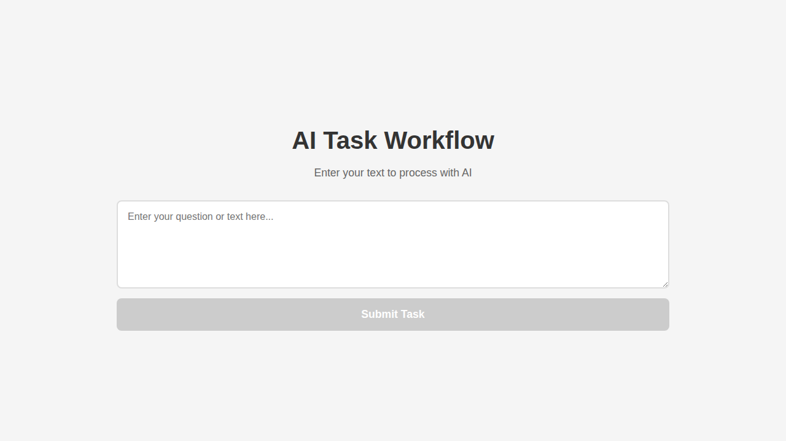
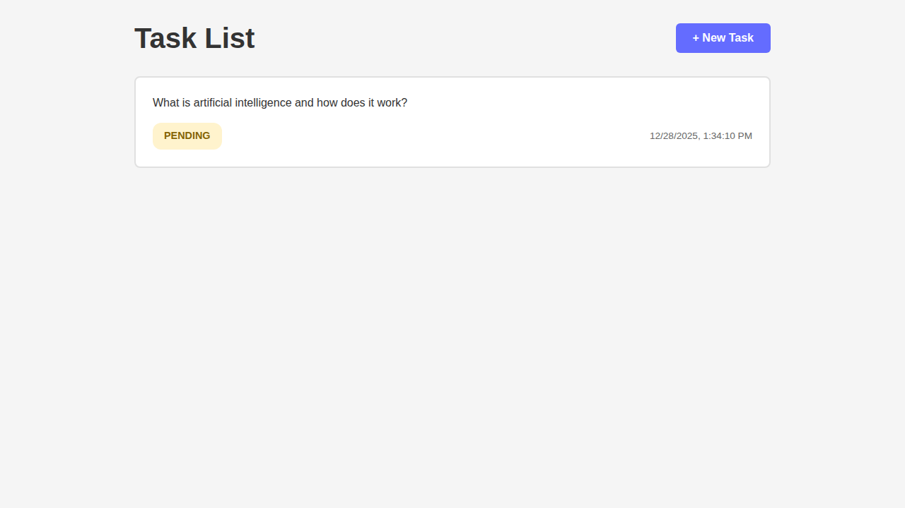
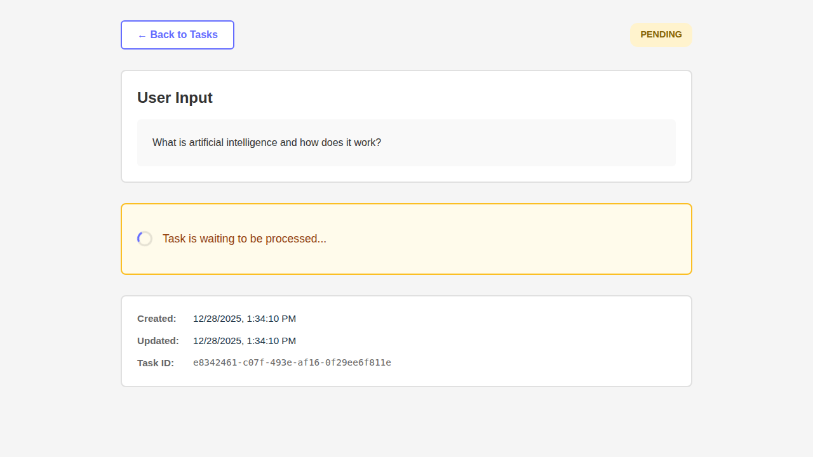

# LLM-Workflow-Example

A PoC AI task workflow system featuring a React frontend and NestJS backend with Azure Service Bus message queue and PostgreSQL database. Users can submit text to be processed by OpenAI's API asynchronously.

## Architecture Overview

The system follows a microservices architecture with message queue pattern:

1. **User submits text** → Frontend sends to backend API
2. **Backend publishes task** → Task saved to PostgreSQL, message published to Azure Service Bus
3. **Worker processes task** → Subscriber consumes message, calls OpenAI API
4. **Result stored** → AI response saved to database
5. **User views result** → Frontend polls for updates and displays result

## Screenshots

### Input Page
The main page where users submit their text for AI processing:



### Task List
View all submitted tasks with their current status (pending, processing, completed, or failed):



### Task Detail
Detailed view of a task showing user input and processing status:



## Project Structure

```
.
├── apps/
│   ├── frontend/          # React + Vite + TypeScript frontend (Port 5173)
│   │   ├── src/
│   │   │   ├── pages/     # Input, TaskList, TaskDetail pages
│   │   │   ├── services/  # API client
│   │   │   └── types/     # TypeScript types
│   │   └── package.json
│   └── backend/           # NestJS backend service (Port 3001)
│       ├── src/
│       │   ├── tasks/     # Task controller, service, entity
│       │   ├── servicebus/ # Azure Service Bus publisher & consumer
│       │   ├── openai/    # OpenAI service
│       │   └── config/    # Configuration files
│       └── package.json
├── docker-compose.yml     # PostgreSQL service
└── package.json           # Root workspace configuration
```

## Tech Stack

- **Frontend**: React 19, TypeScript, Vite, React Router, Axios
- **Backend**: NestJS 11, TypeScript, TypeORM, Azure Service Bus, OpenAI SDK
- **Database**: PostgreSQL 16
- **Message Queue**: Azure Service Bus
- **Package Manager**: npm with workspaces

## Prerequisites

- Node.js >= 20.x
- npm >= 10.x
- Docker & Docker Compose (for PostgreSQL)
- OpenAI API Key (for AI processing)
- Azure Service Bus namespace

## Getting Started

### 1. Clone the Repository

```bash
git clone <repository-url>
cd LLM-Workflow-Example
```

### 2. Install Dependencies

Install all dependencies for the entire monorepo:

```bash
npm install
```

### 3. Start Infrastructure Services

Start PostgreSQL using Docker Compose:

```bash
docker-compose up -d
```

This will start:
- PostgreSQL on port 5432

### 4. Configure Environment Variables

**Backend Configuration:**

```bash
cd apps/backend
cp .env.example .env
```

Edit `.env` and set your configuration:

```env
OPENAI_API_KEY=your-actual-api-key-here
AZURE_SERVICE_BUS_CONNECTION_STRING=Endpoint=sb://your-namespace.servicebus.windows.net/;SharedAccessKeyName=RootManageSharedAccessKey;SharedAccessKey=your-key
AZURE_SERVICE_BUS_QUEUE_NAME=ai-tasks
```

**Frontend Configuration:**

```bash
cd apps/frontend
cp .env.example .env
```

The default configuration should work for local development.

### 5. Run the Application

**Option A: Run all services together (from root):**

```bash
npm run dev
```

**Option B: Run services individually:**

Backend:
```bash
cd apps/backend
npm run dev
```

Frontend (in a new terminal):
```bash
cd apps/frontend
npm run dev
```

### 6. Access the Application

- **Frontend**: http://localhost:5173
- **Backend API**: http://localhost:3001

## Usage

1. **Submit a Task**
   - Navigate to http://localhost:5173
   - Enter your text in the input field
   - Click "Submit Task"

2. **View Task List**
   - After submission, you'll be redirected to the task list
   - The list auto-refreshes every 3 seconds
   - Tasks show their current status (pending, processing, completed, failed)

3. **View Task Details**
   - Click on any task to view details
   - The detail page auto-refreshes while the task is processing
   - Once complete, the AI result will be displayed

## Development

### Backend Development

```bash
cd apps/backend

# Run in watch mode
npm run dev

# Run tests
npm test

# Lint code
npm run lint

# Build for production
npm run build
```

### Frontend Development

```bash
cd apps/frontend

# Run dev server
npm run dev

# Build for production
npm run build

# Preview production build
npm run preview

# Lint code
npm run lint
```

### Database Management

The database schema is automatically synchronized in development mode (TypeORM synchronize: true).

To access PostgreSQL directly:

```bash
docker exec -it llm-workflow-postgres psql -U postgres -d llm_workflow
```

## Testing

Run tests for all applications:

```bash
npm test
```

Run tests for individual applications:

```bash
cd apps/backend && npm test
cd apps/frontend && npm test
```

## Building for Production

Build all applications:

```bash
npm run build
```

Build outputs:
- Frontend: `apps/frontend/dist`
- Backend: `apps/backend/dist`

## Environment Variables

### Backend

| Variable | Description | Default |
|----------|-------------|---------|
| `DB_HOST` | PostgreSQL host | `localhost` |
| `DB_PORT` | PostgreSQL port | `5432` |
| `DB_USERNAME` | PostgreSQL username | `postgres` |
| `DB_PASSWORD` | PostgreSQL password | `postgres` |
| `DB_NAME` | Database name | `llm_workflow` |
| `AZURE_SERVICE_BUS_CONNECTION_STRING` | Azure Service Bus connection string | *Required* |
| `AZURE_SERVICE_BUS_QUEUE_NAME` | Azure Service Bus queue name | `ai-tasks` |
| `OPENAI_API_KEY` | OpenAI API key | *Required* |
| `PORT` | Backend server port | `3001` |
| `FRONTEND_URL` | Frontend URL for CORS | `http://localhost:5173` |

### Frontend

| Variable | Description | Default |
|----------|-------------|---------|
| `VITE_API_URL` | Backend API URL | `http://localhost:3001` |

## Troubleshooting

### Database Connection Issues

1. Ensure PostgreSQL is running: `docker-compose ps`
2. Check logs: `docker-compose logs postgres`
3. Verify connection settings in backend `.env`

### Azure Service Bus Connection Issues

1. Verify your connection string is correct
2. Check that the queue exists in your Service Bus namespace
3. Ensure proper permissions are configured
4. Check Azure Service Bus logs in Azure Portal

### OpenAI API Issues

1. Verify your API key is set correctly in backend `.env`
2. Check backend logs for error messages
3. Ensure your OpenAI account has available credits

### Frontend Cannot Connect to Backend

1. Verify backend is running on port 3001
2. Check `VITE_API_URL` in frontend `.env`
3. Ensure CORS is properly configured

## Cleanup

Stop and remove all Docker containers:

```bash
docker-compose down
```

Remove volumes (deletes all data):

```bash
docker-compose down -v
```

Clean build artifacts and dependencies:

```bash
npm run clean
```

## Project Scripts

- `npm run build` - Build all applications
- `npm run dev` - Run all applications in development mode
- `npm run start` - Start all applications in production mode
- `npm test` - Run tests for all applications
- `npm run lint` - Lint all applications
- `npm run clean` - Clean all build artifacts and node_modules

## Contributing

1. Make changes in the appropriate app/package
2. Test your changes locally
3. Ensure all tests pass
4. Submit a pull request

## License

UNLICENSED
